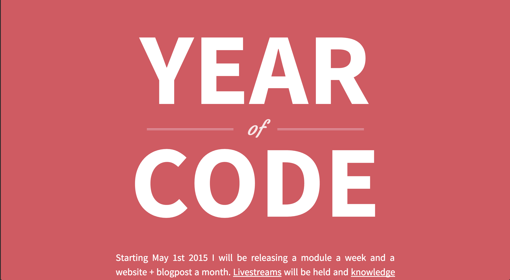

# year-of-code
[![build status][travis-image]][travis-url]
[![js-standard-style][standard-image]][standard-url]



Year of code website. Project I'm running for a year creating a module a week,
a website a month and an article a month. Great fun, mucho viz!

## Installation
```bash
$ hub clone yoshuawuyts/year-of-code
```

## License
[MIT](https://tldrlegal.com/license/mit-license)

[travis-image]: https://img.shields.io/travis/yoshuawuyts/year-of-code.svg?style=flat-square
[travis-url]: https://travis-ci.org/yoshuawuyts/year-of-code
[standard-url]: https://github.com/feross/standard
